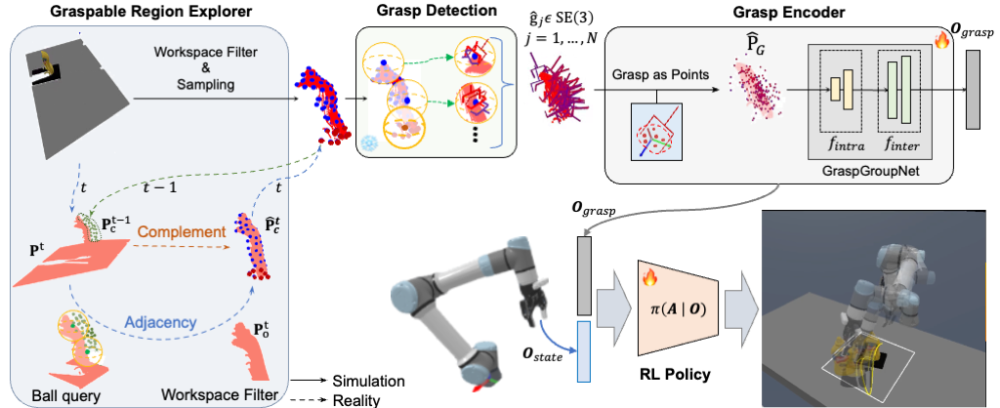

<h2 align="center">
  <b>GAP-RL: Grasps As Points for RL Towards Dynamic Object Grasping</b>

<b><i>RA-L 2024 </i></b>

<div align="center">
    <a href="https://ieeexplore.ieee.org/abstract/document/10750070/" target="_blank">
    </a>
    <a href="https://arxiv.org/abs/2410.03509" target="_blank">
    </a>
    <a href="https://www.youtube.com/watch?v=E1ySAOxOBb8" target="_blank">
    </a>
</div>
</h2>

Official code of RA-L 2024 [paper](https://ieeexplore.ieee.org/abstract/document/10750070/).

# Framework

The total framework consists of 4 parts: `Graspable Region Explorer`, `Grasp Detection`, `Grasp Encoder` and `RL Policy`.

# Installation
This code has been tested on Ubuntu20.04 with Cuda 11.7, Python3.9 and Pytorch 1.13.1.
Environment: create a conda environment with necessary packages specified by `requirements.txt`.
Run the following code to generate the seperate `gap_rl` package:
```shell
pip install -e .
```
Our framework combines a LocalGrasp model for fast and object-centric grasp detection. You can configure it under the localgrasp directory.

# Simulation Settings
<p>

</p>

**Visualization Demo**: You can run the following code to visualize the trajectories 
({'random2d', 'line', 'circular', 'bezier2d'} as {'Rotation', 'Line', 'Circular', 'Random'} in the paper):
```shell :
cd gap_rl/examples
python test_env_trajs.py
```

**Trajectories Generation**: `gap_rl/utils/traj_utils.py`.

# Main Modules
**Graspable Region Explorer**: `gap_rl/sim2real/sim2real_traj_following.py` -> `track_grasps`.

**Grasp Detection**: `gap_rl/localgrasp/`.

**Grasp Encoder**: `gap_rl/algorithms/rl_utils.py` -> `CustomGraspPointGroupExtractor`.

**RL Policy**： training -> `gap_rl/algorithms/scripts/sac_train.py`, evaluation -> `gap_rl/algorithms/scripts/sac_LoG_dynamic_eval.py`.

**Sim2Real Implementation**: `gap_rl/sim2real/sim2real_traj_following.py`.

# Important Details
In simulation, points filtering + grasp detection totally takes about 60-90ms per step, rendering and physical computation takes about 20-30ms per step, and thus totally it takes >100ms to collect one sample, which decrease the sample efficiency, considering that our training procedure need > 2M steps, which totally may take >48h for single training process, We think it's too long.

So We have tried another way to optimize the time burden -- pre-collect the grasps under different viewpoints and save them in the json files, just as the following picture shows. And during the training procedure, we take the pre-collected grasps from the nearest 4 viewpoints. The assumption here is that our LoG model detect grasps mainly depend on the viewpoints (distance is not important since the point cloud is normalized in the object points center.)

<p>

</p>

In this way, and also we utilize the Vectorized Environments from Stable Baselines 3, one single training process has been reduced from >48h to ~6h. 
Our tsne analysis and real experiments have demonstrated that it is useful and efficient in the dynamic settings.

**Grasp Collection**: `gap_rl/examples/gen_LoG_grasps.py`.

**4-View Grasp Selection**:  `gap_rl/envs/pick_single.py` -> `_compute_near_grasps`.

# Citation

If you find this code useful for your research, please use the following BibTeX entry.

```
@article{xie2024gap,
  title={GAP-RL: Grasps as Points for RL Towards Dynamic Object Grasping},
  author={Xie, Pengwei and Chen, Siang and Chen, Qianrun and Tang, Wei and Hu, Dingchang and Dai, Yixiang and Chen, Rui and Wang, Guijin},
  journal={IEEE Robotics and Automation Letters (RA-L)},
  year={2024}
}
```